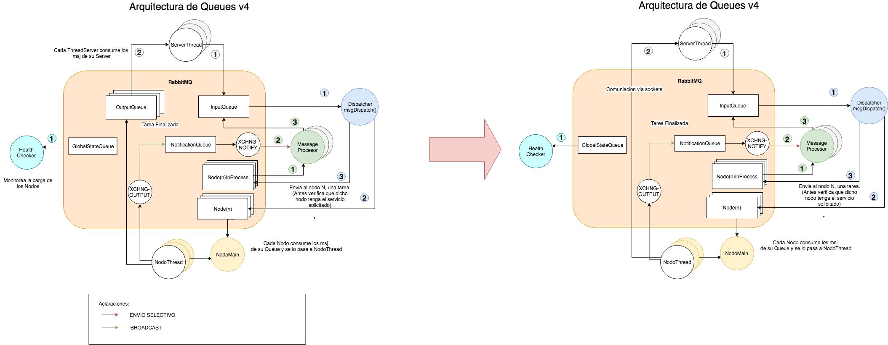

# Punto3 - Balanceador de Carga:

### Indice
1. [Propuesta](#Propuesta)
- [Dependencias](#Dependencias)
- [Build & Run](#Build-&-Run)
- [Scripts](#Scripts)
- [Estado Desarrollo](#Estado-Desarrollo)

### Propuesta

Se diseño la siguiente arquitectura de colas:



#### Diagramas de Clases:

#### Cliente - Server


#### Dispatcher


#### Nodo


#### Aclaraciones

1. **ServerThread**, escucha peticiones de clientes. Es alimentado de dos Queues (Input / Output).

- **msgDispatch**, hilo encargado de atender un msg de la input Queue y enviarlo a Nodo para que atienda la solicitud.

- **messageProcessor**, hilo/s encargado/s de atender un msg de la inprocess Queue y esperar la confirmacion de la tarea en la notification Queue. En el caso de que se no se reciba la confirmacion se reenvia el msj a la cola de input y se elimina el nodo de la lista de nodos activos.

- **healthChecker**, hilo encargado de monitorear el estado globlal del sistema y realizar la correspondiente acción para volver a estado normal la red.

| Estado | Carga*  | Acción
| :------------- | :------------- |
| **GLOBAL_CRITICAL**  | 80% - 100% | Se crean **nodosActivos/2** nuevos nodos (si es mayor a 1, sino 1)**
| **GLOBAL_ALERT** | 50% - 80% | Se crean **nodosActivos/4** nuevos nodos (si es mayor a 1, sino 1)**
| **GLOBAL_NORMAL** | 20% - 50% | -
| **GLOBAL_IDLE** | 0% - 20% | Se eliminan **nodosActivos/3** nodos (si es mayor a 1, sino 1)

*Sumatoria de todas las cargas de cada Nodo.  
**Asignandole todos los servicios existentes.


- **Nodo**, servidor de aplicación concreto, que por cada nuevo nodo llama a un Thread para que atienda la tarea.

#### Estructuras:

**InputQueue**, es aquella queue que recibe peticiones. El ServerMain es su productor y el Dispatcher su consumidor.

**processQueue (n)**, es aquella queue que recibe peticiones ya destinadas a un Nodo en particular. El msgProcessor es su productor y el Nodo su consumidor.

**OutputQueue (n)**, es aquella queue en donde se escriben los resultados. El Nodo es el productor y el ServerMain es su consumidor.

**Bibliografia / Ejemplos**:
- [Balanceo de Carga](https://www.digitalocean.com/community/tutorials/what-is-load-balancing)
- [RabbitMQ - Tutoriales](https://www.rabbitmq.com/getstarted.html)

### Dependencias

1. Instalar RabbitMQ ([Official Page](rabbitmq.com))

- Instalar dependencias de java
```sh
mvn install
```

### Build & Run

1. Iniciar servicio de RabbitMQ
```sh
rabbitmq-server start
```

- Correr las clases en el siguiente orden:
```
Dispatcher
NodeMain
ServerMain
ClientGenerator
```

### Scripts

Para testear rapidamente el funcionamiento del balanceador:

1. Correr las clases `Dispatcher`  y `NodeMain`.

- Generar peticiones directo sobre RabbitMQ con script en python:
```sh
nano ClientGenerator.py
# EDITAR los parametros USER y PASS con sus credenciales
python3 ClientGenerator.py
```

- Observe el compartamiento a través de la consola o log generado por el Dispatcher (`Practico2/Dispatcher.log`). Preste atención a las lineas que contienen el estado del balanceador, la cual indica el estado actual, la carga actual y la carga máxima (ambas sumatoria de todos los nodos):
```csharp
22:55:55 [pool-1-thread-10] INFO  -  [HEALTH_CHECKER] Global State -> GLOBAL_NORMAL | CURRNT_LOAD:113 | MAX_LOAD:240
```


### Estado Desarrollo

#### TO-FIX:

- [ ] Revisar getNextNodeSafe() **[DONE]**
- [ ] Corregir creacion dinamica de Nodos. **[DONE]**
- [ ] Hacer que msgProcess() sea multi-Thread. (Single-Thread ocasiona problemas de lectura cuando hay mucha carga). **[DONE]**

#### TO-DO:

- [ ] Agregar script que tire nodos al azar.
- [ ] Obtener configuracion de nodos de un archivo externo (Sacar Nodos harcodeados del Dispatcher).
- [ ] Persistir Lista de Nodos Activos cada cierto timepo x (Para recurperarse en caso de caida del dispatcher).
