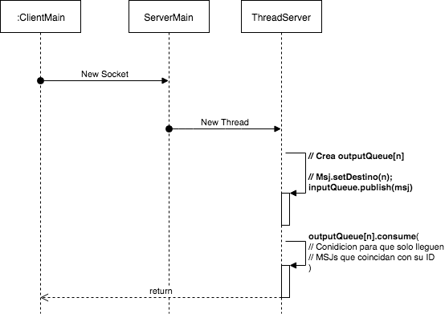
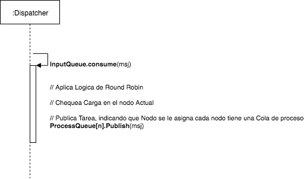

### Punto3 - Balanceador de Carga:

Se diseño la siguiente arquitectura de colas:

#### Diagramas de Clases:

#### Cliente - Server

#### Dispatcher

#### Nodo

#### Aclaraciones

1. **ServerThread**, escucha peticiones de clientes. Es alimentado de dos Queues (Input / Output).

- **Dispatcher**

  - **msgDispatch**, hilo encargado de atender un msg de la input Queue y enviarlo a Nodo para que atienda la solicitud.

  - **msgProcess**, hilo/s encargado/s de atender un msg de la inprocess Queue y esperar la confirmacion de la tarea en la notification Queue. En el caso de que se no se reciba la confirmacion se reenvia el msj a la cola de input y se marca el nodo en estado *DEAD*.

- **healthChecker**, hilo encargado de monitorear el estado globlal del sistema y realizar la correspondiente acción para volver a estado normal la red.

| Estado | Carga*  | Acción
| :------------- | :------------- |
| **GLOBAL_CRITICAL**  | 80% - 100% | Se crean **nodosActivos/2** nuevos nodos**
| **GLOBAL_ALERT** | 60% - 80% | Se crean **nodosActivos/4** nuevos nodos**
| **GLOBAL_NORMAL** | 20% - 60% | -
| **GLOBAL_IDLE** | 0% - 20% | Se eliminan **nodosActivos/3** nodos

*Sumatoria de todas las cargas de cada Nodo.  
**Asignandole todos los servicios existentes.

- **Nodo**, servidor de aplicación concreto, que por cada nuevo nodo llama a un Thread para que atienda la tarea.

#### Estructuras:

**InputQueue**, es aquella queue que recibe peticiones. El ServerMain es su productor y el Dispatcher su consumidor.

**processQueue (n)**, es aquella queue que recibe peticiones ya destinadas a un Nodo en particular. El Dispatcher es su productor y el Nodo su consumidor.

**OutputQueue (n)**, es aquella queue en donde se escriben los resultados. El Nodo es el productor y el ServerMain es su consumidor.

**Bibliografia / Ejemplos**:
- [Balanceo de Carga](https://www.digitalocean.com/community/tutorials/what-is-load-balancing)
- [RabbitMQ - Tutoriales](https://www.rabbitmq.com/getstarted.html)
