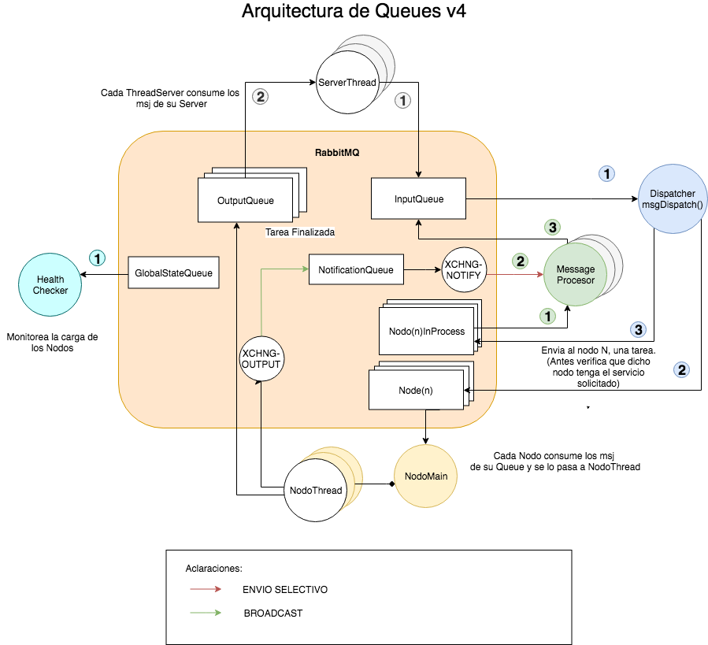

### Punto3 - Balanceador de Carga

Se diseño la siguiente arquitectura de colas:

#### Diagramas de Clases:

#### Cliente - Server

#### Dispatcher

#### Nodo

**ServerMain**, escucha peticiones de clientes. Es alimentado de dos Queues (Input / Output).

**Dispatcher**, encargado de aplicar la lógica de selección del Nodo

**Nodo**, servidor de aplicación concreto.

#### Estructuras:

**InputQueue**, es aquella queue que recibe peticiones. El ServerMain es su productor y el Dispatcher su consumidor.

**processQueue**, es aquella queue que recibe peticiones ya destinadas a un Nodo en particular. El Dispatcher es su productor y el Nodo su consumidor.

**OutputQueue**, es aquella queue en donde se escriben los resultados. El Nodo es el productor y el ServerMain es su consumidor.

**Bibliografia / Ejemplos**:
- [Balanceo de Carga](https://www.digitalocean.com/community/tutorials/what-is-load-balancing)
- [RabbitMQ - RPC](https://www.rabbitmq.com/tutorials/tutorial-six-java.html)
