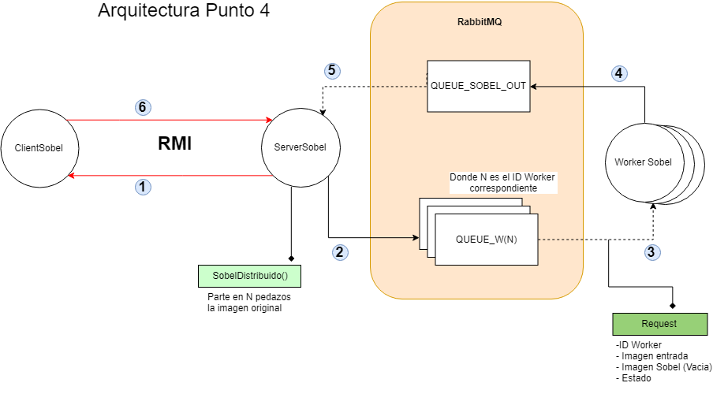

# Punto4 - Sobel:

### Indice
1. [Propuesta](#Propuesta)
2. [Comunicacion](#Comunicacion)
3. [Build & Run](#Build-&-Run)
4. [Conclusiones](#Conclusiones)
5. [Estado Desarrollo](#Estado-Desarrollo)

### Propuesta

Se diseño la siguiente arquitectura que implementa RMI y Colas:



### Comunicacion
- `ServerSobel`: RMI con cliente --> Puerto 80
- `WorkerSobel`: envia resultados a ServerSobel --> QUEUE_W(N) 
- `SobelRequest`: correlacion entre WorkerSobel y parte de la imagen asignada.

### Buld & Run

1. Iniciar RabbitMQ

```sh
rabbitmq-server start
```

- Correr las clases en el siguiente orden:
```
1. ServerSobel
2. SobelClient
```

### Conclusiones
Se concluye que se ven reducciones de tiempo a medida que se ingresen mayor cantidad de Workers en diferentes iteraciones de `ServerSobel.java`
Sin embargo a partir de los 12 Workers instanciados no se notan diferencias de tiempo apreciables, incluso llegando a tardar mas tiempo que 
las iteraciones anteriores con menos Workers. Se asocia la demora (con respecto a realizar la operacion localmente) a la implementacion de una estructura de colas 
pudiendo ServerSobel tardar mas en leer los resultados, o bien que tarden mas en ser enviados por parte de `WorkerSobel.java` junto con 
el tiempo que conlleva dividir la imagen y declarar las conexiones y colas de los Workers .

- Ejemplo de Sobel localmente (Vista del cliente).
```
21:44:04 [main] INFO  - ----- SobelClient iniciado -----
Ingrese la ruta de la imagen a modificar: 
images/pc1.jpg
MENU
1. Sobel Local (a)
2. Sobel Distribuido mejorado (c)
0. Terminar
Ingrese una opcion>
1
21:44:25 [main] INFO  - W:1200
21:44:25 [main] INFO  - H:601
21:44:26 [main] INFO  -  ELAPSED TIME: 1558
Se ha hecho la operacion exitosamente.
21:44:26 [main] INFO  - La nueva imagen se ubica dentro del proyecto en la ruta: images/pc1-SobelResult.jpg
```

-Ejemplo de Sobel distribuido con 10 Workers (Vista del cliente). 

```
21:46:38 [main] INFO  - ----- SobelClient iniciado -----
Ingrese la ruta de la imagen a modificar: 
images/pc1.jpg
MENU
1. Sobel Local (a)
2. Sobel Distribuido mejorado (c)
0. Terminar
Ingrese una opcion>
2
----- Cliente conectado a server en puerto 80-----
21:47:02 [main] INFO  -  ELAPSED TIME: 2558
Se ha hecho la operacion exitosamente.
21:47:02 [main] INFO  - La nueva imagen se ubica dentro del proyecto en la ruta: images/pc1-SobelResult.jpg
```

### Desarrollo
#### Mejoras a realizar:
- [ ] Persistir extaer los datos de los Workers que conoce ServerSobel desde un archivo externo, de manera que no se instancien en su `main` ya que fisicamente representan maquinas distintas, instanciadas no necesariamente en el mismo momento.
- [ ] Permitir que los Workers atiendan peticiones pertenecientes a varios clientes y el ServerSobel pueda llevar un control de los mismos de manera concurrente. 
